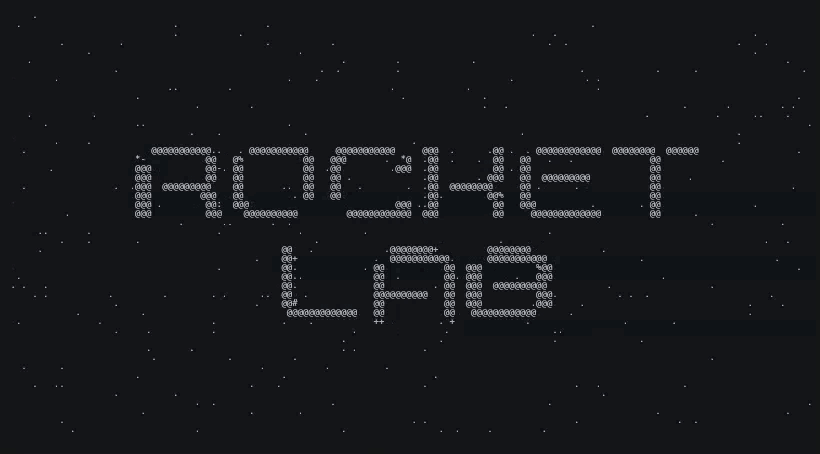

# rocketlab



A space mission simulator: launch rockets and probes, assemble your own, and
write flight software for them. Two clients watch the same simulation — a
terminal dashboard and a graphical map view.

## Building

Requires a C++20 compiler, CMake ≥ 3.24 and Ninja. Catch2 is fetched
automatically at configure time.

```sh
cmake --preset dev
cmake --build --preset dev
ctest --test-dir build/dev --output-on-failure
```

`build/dev/tests/rocketlab_tests` runs the suite directly, with Catch2's own
tag filtering (`[orbital]`, `[time]`).

## Layout

```
libs/core/     simulation core: no UI, no third-party dependencies
libs/proto/    snapshot and command types shared by the daemon and clients
libs/render/   camera and scene building, renderer-agnostic
apps/simd/     headless daemon: owns the world, ticks the physics
apps/tui/      FTXUI client: telemetry, entity list, 2D map view
apps/gui/      graphical client: same camera, rasterised to a window
scenarios/     vessel and mission definitions
tests/         unit tests, numeric
```

## Architecture

Four decisions shape everything below. They were made deliberately and are
worth re-reading before changing anything structural.

### The daemon is headless, and the clients are separate processes

`simd` owns the world and never links a UI library. The TUI and the GUI are
independent clients of it. This is not just tidiness:

- FTXUI takes over stdout and the terminal. Any `std::cout` from any thread —
  including a logging library's — corrupts its rendering. Keeping it in its
  own process makes that class of bug impossible rather than merely unlikely.
- A crash in the graphical client, or in a user's flight software, does not
  take the simulation with it.
- The core can be regression-tested headless, and the TUI can be detached into
  a tmux pane while the map view keeps running.

State flows out over double-buffered shared memory: the daemon publishes a POD
snapshot at frame rate, clients read it without locking. Commands flow back
over a Unix domain socket, which is low-rate and therefore allowed to be
simple.

### Clients never do physics

The snapshot carries instantaneous state only. Anything predictive — the
osculating orbit, sphere-of-influence transitions, closest approach, a
manoeuvre plan — is answered by an explicit query to the daemon.

The tempting alternative is to have the renderer propagate the orbit itself
from the elements in the snapshot. That duplicates the patched-conic logic
into every client and guarantees that the two drift apart. One source of truth
means the TUI and the GUI cannot disagree about where the rocket will be.

### Simulation time is a first-class value, and the wall clock is quarantined

All simulation time is TDB seconds since J2000, carried in `Instant`. Nothing
in the core reads a real clock; `FrameTimer` is the single exception and exists
only so a client can convert a real frame duration into a simulation span via
`SimClock::frame_span`.

Two consequences worth preserving:

- **Propagation is analytic.** `propagate()` moves a state along its osculating
  conic exactly, for any step size, so a warp factor of 100000 costs the same as
  1. Anything under thrust, drag or third-body perturbation cannot use it and
  needs a numerical integrator instead.
- **Precision is spent where it is needed.** Positions are `double` metres in a
  single root frame; the render origin is shifted to the camera target before
  anything reaches a vertex buffer. Time is never round-tripped through a
  single Julian date, because a double JD resolves to only ~50 µs near the
  present day.

### The 2D map view comes first, and the camera is switchable

The first client is a 2D orthographic map: an orbit reads as an ellipse, there
is no depth-buffer precision problem across nine orders of magnitude, and line
widths and minimum marker sizes are trivial in screen space. A renderer
interface keeps the camera and trajectory code independent of the rasteriser,
so the same map can be drawn into an FTXUI canvas — which is how it will be
developed and tested — and later into a window.

The camera's centre tracks a *selectable* target and sits at a distance from
it. Crucially, that selection is client state, not world state: the daemon does
not know or care what anyone is looking at.

## Roadmap

- **M0 core** — time, two-body Kepler propagation, root frame, headless CLI
- **M1 TUI** — telemetry, entity list, target selection, canvas map view
- **M2** — scenarios, parts, staging, delta-v accounting
- **M3** — Lua flight computer: sandboxed, deterministic, with an instruction budget
- **M4 GUI** — window, same camera, smooth target transitions
- **M5** — patched conics, atmospheres, planets and moons
- **M6** — visual assembly editor, 3D view, docking

## Status

M0 is partly done. The simulation time base and the orbital mechanics are
complete and tested: every conic family propagates, and the numeric suite
covers the degenerate cases (circular, equatorial, retrograde, hyperbolic,
parabolic, radial) plus the invariants that matter — shape preservation,
composability of propagation, and reversibility in time.

Still to come for M0: the world and its root frame, the tick loop, and a
headless CLI to drive them.
